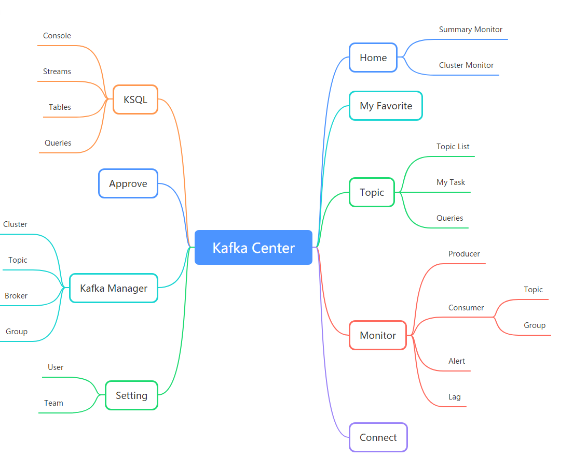
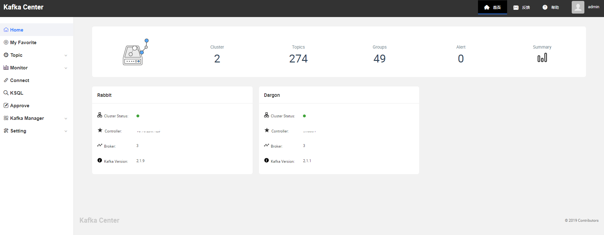

Language: :[us](./README.md)::cn:

# KafkaCenter


KafkaCenter是Kafka 集群管理和维护，生产/消费监控，生态组件使用的统一一站式平台。

[GitHub地址](https://github.com/xaecbd/KafkaCenter) 第一时间更新，请移步查看！

- [KafkaCenter](#kafkacenter)
  - [主要特性](#主要特性)
  - [快速开始](#快速开始)
    - [编译/运行, 贡献代码](#贡献代码)
  - [文档](#文档)
  - [计划](#计划)
  - [Changelog](#changelog)
  - [问题? 建议?](#问题)

## 主要特性



- **Home**->
查看平台管理的Kafka Cluster集群信息及监控信息
- **Topic**->
用户可以在此模块查看自己的Topic，发起申请新建Topic，同时可以对Topic进行生产消费测试。
- **Monitor**->
用户可以在此模块中可以查看Topic的生产以及消费情况，同时可以针对消费延迟情况设置预警信息。
- **Kafka Connect**->
实现用户快速创建自己的Connect Job，并对自己的Connect进行维护。
- **KSQL**->
实现用户快速创建自己的KSQL Job，并对自己的Job进行维护。
- **Approve**->
此模块主要用于当普通用户申请创建Topic，管理员进行审批操作。
- **Setting**->
此模块主要功能为管理员维护User、Team以及kafka cluster信息
- **Kafka Manager**->
此模块用于管理员对集群的正常维护操作。

## 配置
[application.properties](KafkaCenter-Core/src/main/resources/application.properties)

## 快速开始

**Important**: 项目配置信息存储在**mysql**中，因此必须mysql数据库.

资源|依赖情况|用途
---|---|---
mysql|必须|配置信息存储在**mysql**
elasticsearch(7.0+)|非必须|监控信息，例如集群metirc,消费lag可视化等
邮件服务器|非必须|申请、审批，告警邮件提醒
### 1.首先创建数据库及修改配置
#### 创建数据库及表
在数据库中执行[table_script.sql](KafkaCenter-Core/sql/table_script.sql)
#### 初始化配置
下载[application.properties](KafkaCenter-Core/src/main/resources/application.properties),按自己需求修改相应的配置
### 2.其次运行服务
- Docker run(**推荐**)

```
docker run -d -p 8080:8080 --name KafkaCenter -v ${PWD}/application.properties:/opt/app/kafka-center/config/application.properties xaecbd/kafka-center:2.1.0
```

- Local run

**Important**: 项目运行依赖jre1.8
```
$ git clone https://github.com/xaecbd/KafkaCenter.git
$ cd KafkaCenter
$ mvn clean package -Dmaven.test.skip=true
$ cd KafkaCenter\KafkaCenter-Core\target
$ java -jar KafkaCenter-Core-2.1.0-SNAPSHOT.jar
```

### 3.最后访问系统

访问`http://localhost:8080`,管理员用户与密码默认：**admin/admin**
### 贡献代码

You might want to build KafkaCenter locally to contribute some code, test out the latest features, or try
out an open PR:

- [CONTRIBUTING.md](CONTRIBUTING.md) will help you get KafkaCenter up and running.

## 文档

更多文档详见： [KafkaCenter/docs](./docs).<br/>
用户使用文档：[KafkaCenter/docs/UserGuide](./docs/UserGuide.md)  
系统模块简介：[KafkaCenter/docs/Module](./docs/Module.md).<br/>
KafkaConnectUi文档：[KafkaConnectUi](./docs/KafkaConnectUi.md). 

## 计划

查看 [TODO List](https://github.com/xaecbd/KafkaCenter/projects/1)

## Changelog

查看 [CHANGELOG.md](CHANGELOG.md)

## 问题

- If you've found a bug or want to request a feature, please create a [Issue](https://github.com/xaecbd/KafkaCenter/issues/new).
Please check to make sure someone else hasn't already created an issue for the same topic.
- Need help using KafkaCenter? Ask EC Bigdata Team member.
