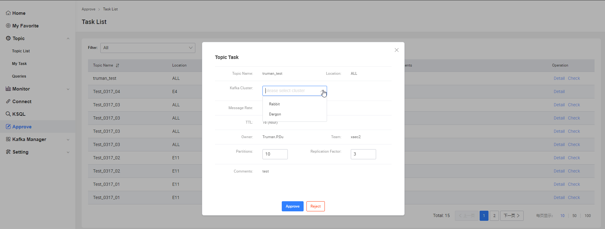
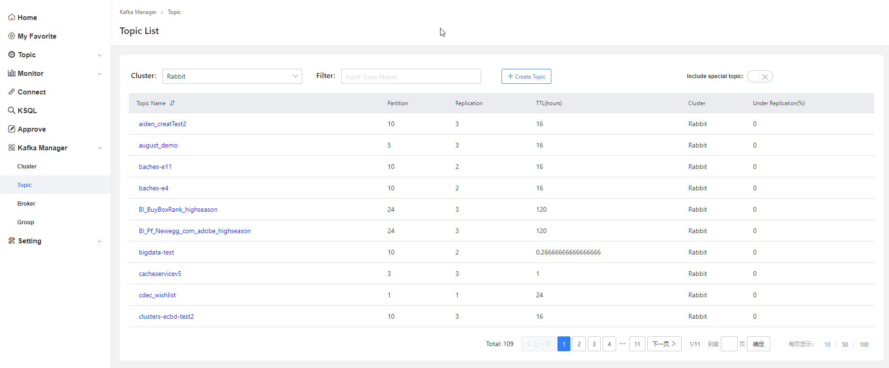
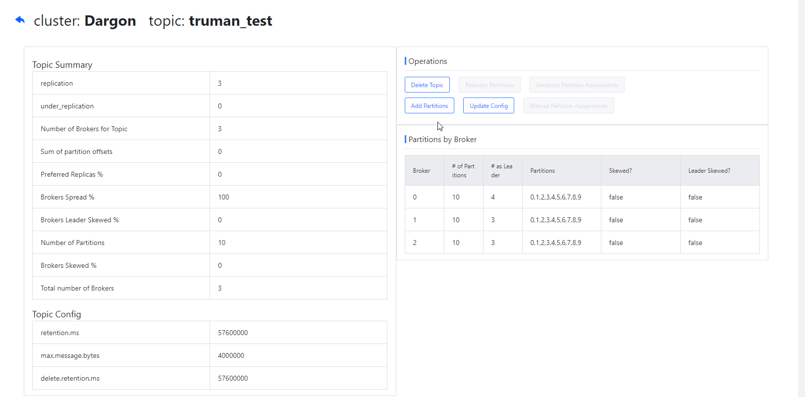
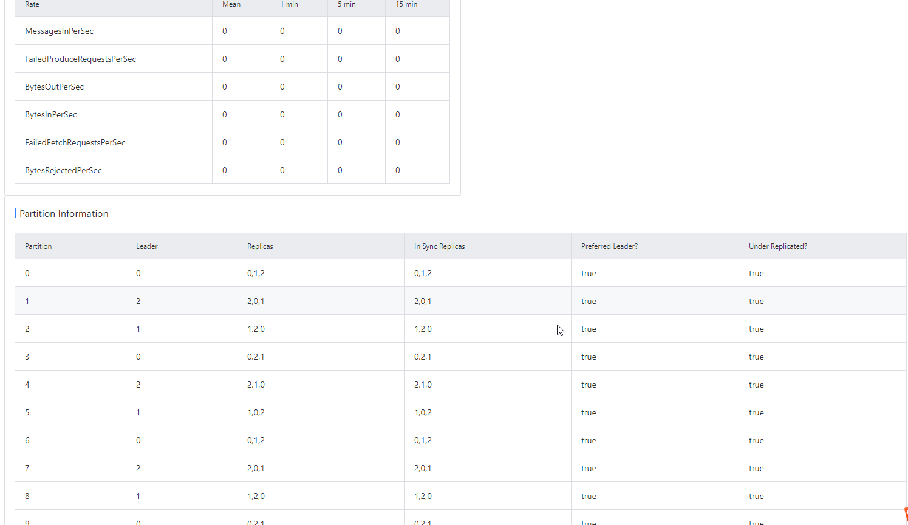
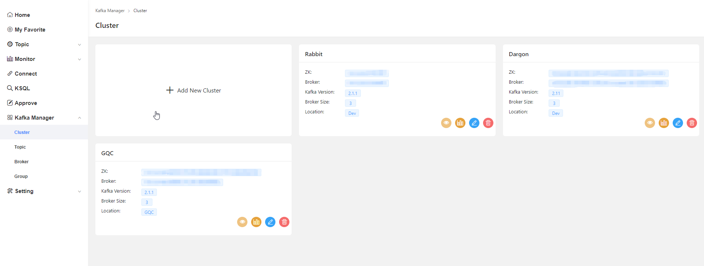
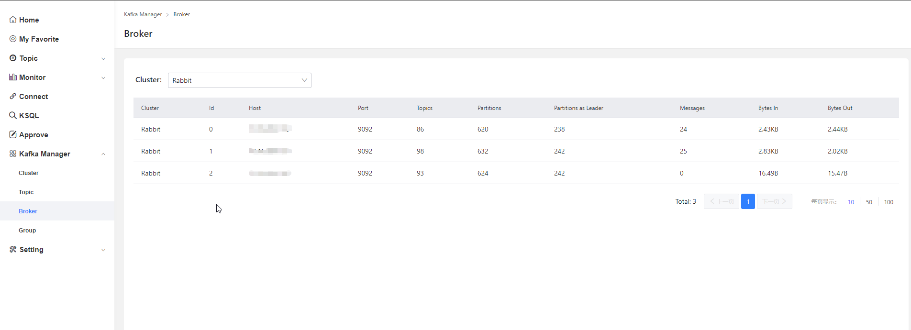
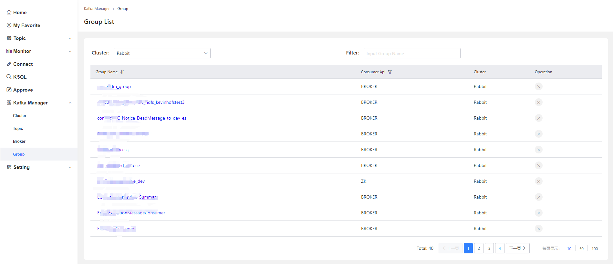
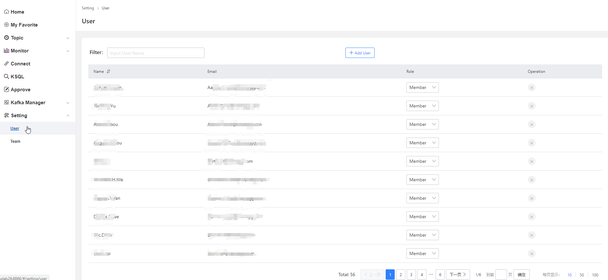
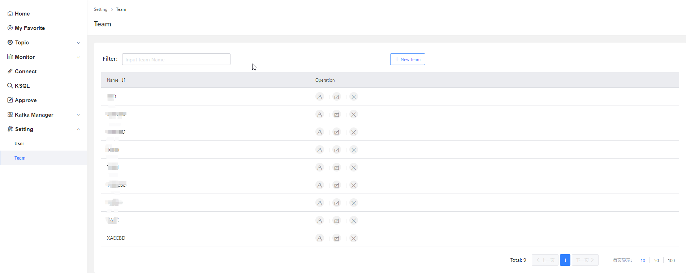

# Topic
## Topic List

***操作范围：***

全部Topic

- Topic -> Topic List -> Detail  查看Topic的详细信息
- Topic -> Topic List -> Queries 对Topic进行**生产/消费**测试
- Topic -> Topic List -> Modify  修改Topic信息(所属Owner/Team)

## My Task

***操作范围：***

全部Task

- Topic -> My Task -> Detail             查看申请的Task信息
- Topic -> My Task -> Delete             删除被拒绝或待审批的Task
- 管理员不能创建Task

  
# Approve

- Approve->check 审批用户的Task
- 根据用户选择的location指定cluster
- 检查用户设置的partition和replication大小是否合理，如不合理做出调整
- 检查其他字段是否合理，如需要拒绝该申请，点击Reject并填写意见。

# Kafka Manager
## Topic

## Cluster

## Broker

## Group

# Setting
## User

## Team
