# Home
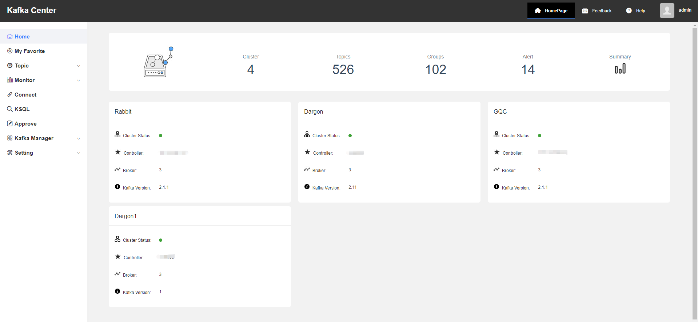
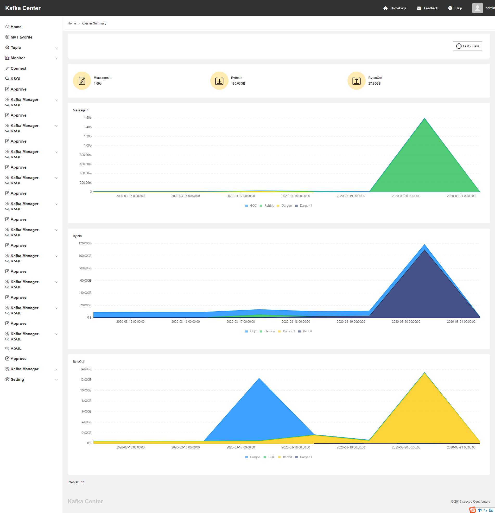
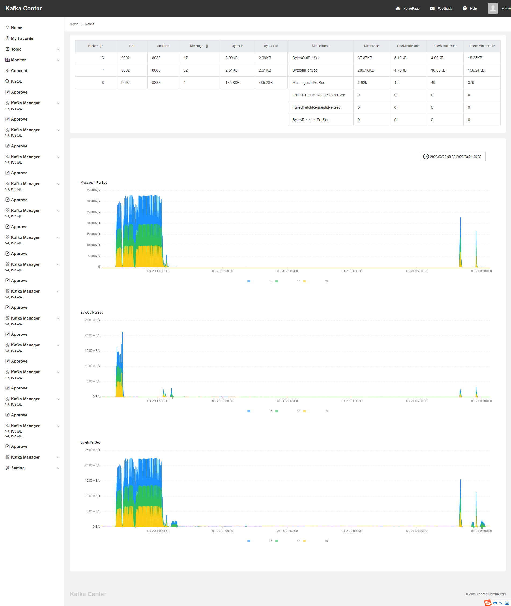
# My Favorite
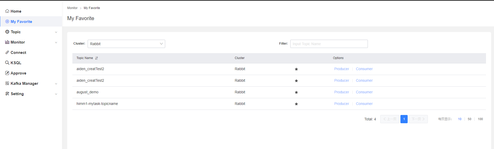
# Topic
## Topic List

***操作范围：*** 

用户所属Team的所有Topic

- Topic -> Topic List -> Detail  查看Topic的详细信息
- Topic -> Topic List -> Mock 对Topic进行**生产**测试
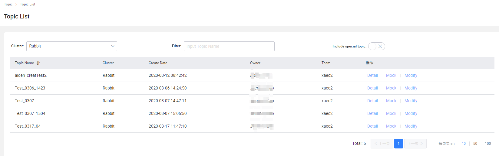
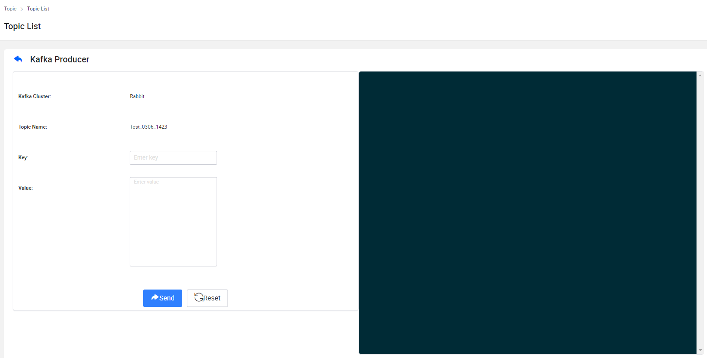
## My Task

**Important**: admin不能申请task,普通用户必须先让管理员新建team后，将用户加入指定team后，才可以申请task。

***操作范围：*** 

用户所属Team的所有Task

- Topic -> My Task -> Detail             查看申请的Task信息
- Topic -> My Task -> Delete             删除被拒绝或待审批的Task
- Topic -> My Task -> Edit               修改被拒绝的Task
- Topic -> My Task ->  Create Topic Task 创建Task
   - 按照表单各字段要求填写信息
   - 点击确认，提交申请
 
   **审批结果：**
 
   - 审批通过：Topic将会被创建在管理员指定的集群
   - 审批拒绝：用户收到邮件，返回到My Task，点击对应Task后面的Edit，针对审批意见进行修改

***Topic命名规则：*** 

**只能**包含：数字、大小写字母、下划线、中划线、点；长度大于等于3小于等于100。

**不推荐**：下划线开头；
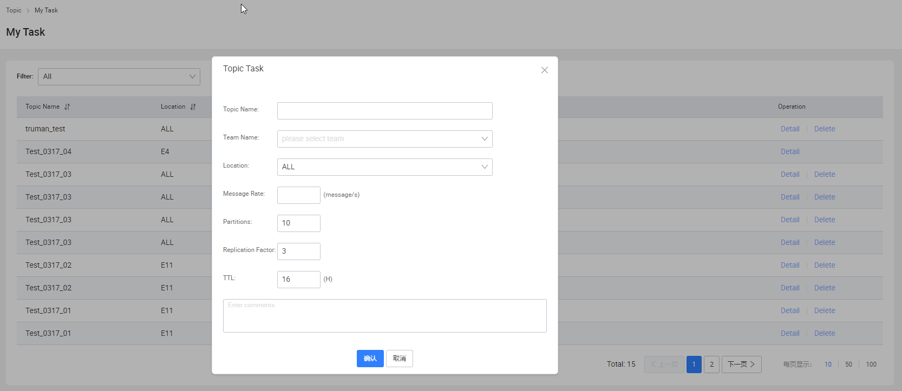
## Queries

可对所有Topic进行**消费**测试
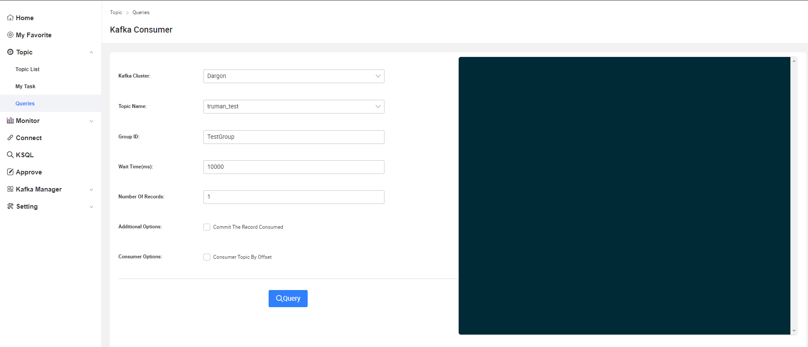

# Monitor

## Producer
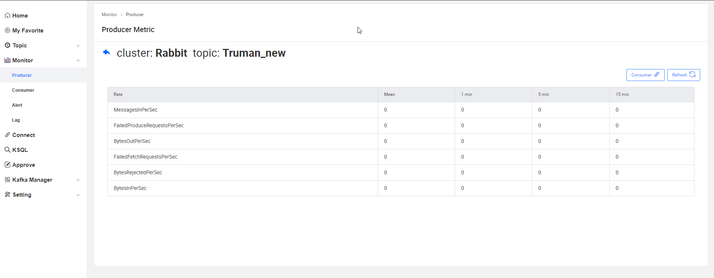
## Consumer
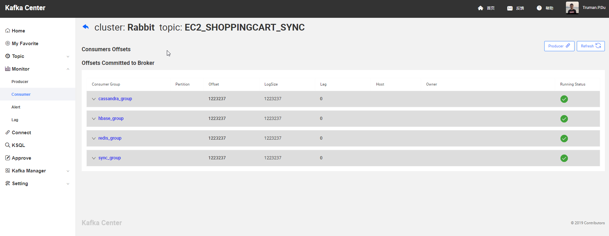
## Lag
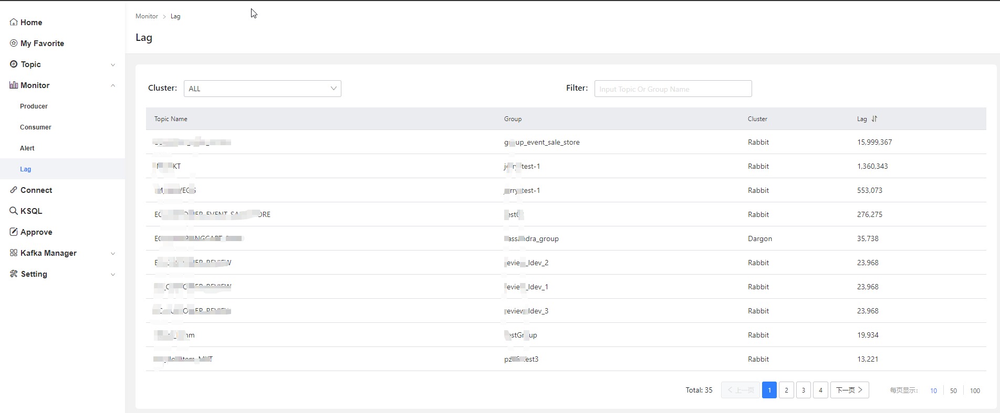
## Alert
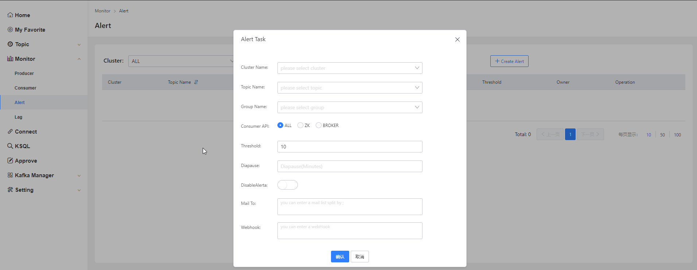
# Connect
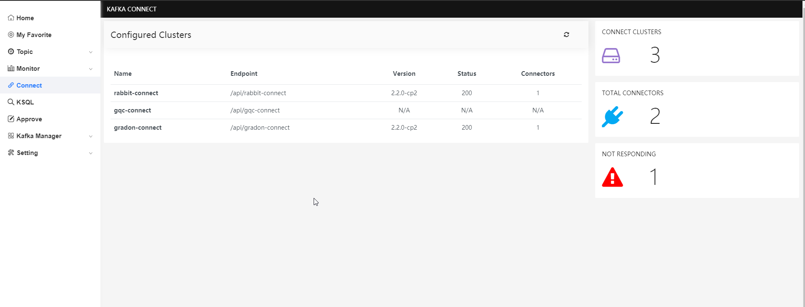
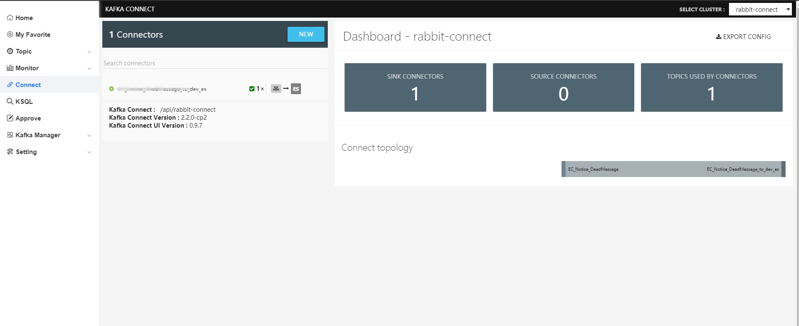
# KSQL
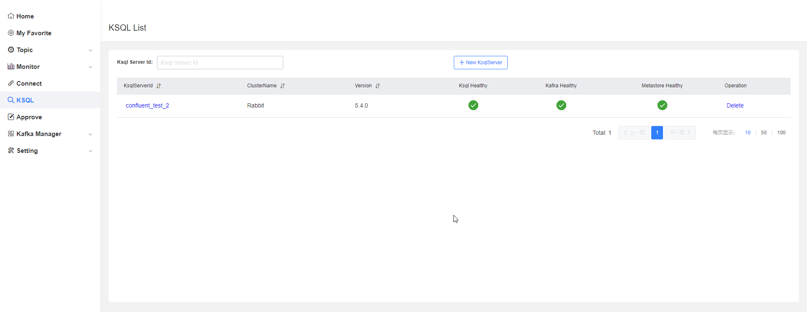
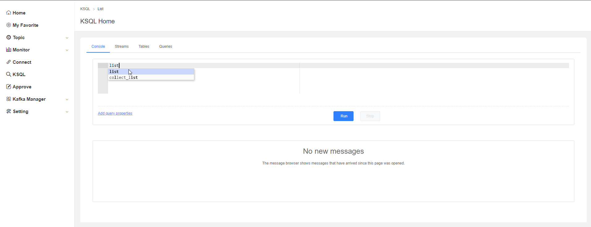
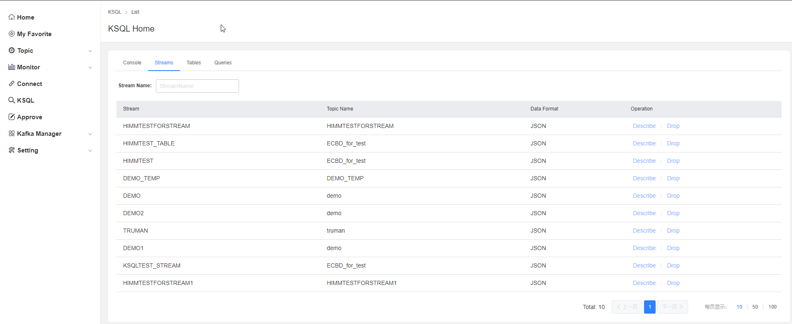
# Approve

- Approve->check 审批用户的Task
- 根据用户选择的location指定cluster
- 检查用户设置的partition和replication大小是否合理，如不合理做出调整
- 检查其他字段是否合理，如需要拒绝该申请，点击Reject并填写意见。

# Kafka Manager
## Topic

## Cluster

## Broker

## Group

# Setting
## User

## Team
