## 首先使用系统默认admin账户登录系统
##### 1. 使用系统配置用户admin/admin登陆系统
##### 2. 登录系统后进入Kafka Manager -> Cluster，点击Add New Cluster根据提示填写集群信息
##### 3. 进入Setting -> User，点击Add User为系统添加用户(test和testAdmin),test用户角色为Member，testAdmin用户角色为Admin
   **Important**:除系统自带admin账户之外，必须创建一个角色为admin的账户，否则系统中涉及给管理员发邮件的地方都会报错(eg:创建task)
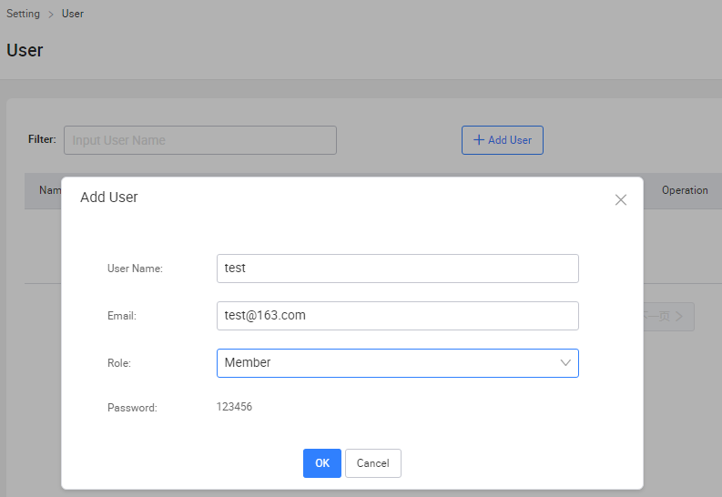
##### 4. 添加用户成功之后，进入Setting -> Team,点击New Team，填写team名称(test_team)
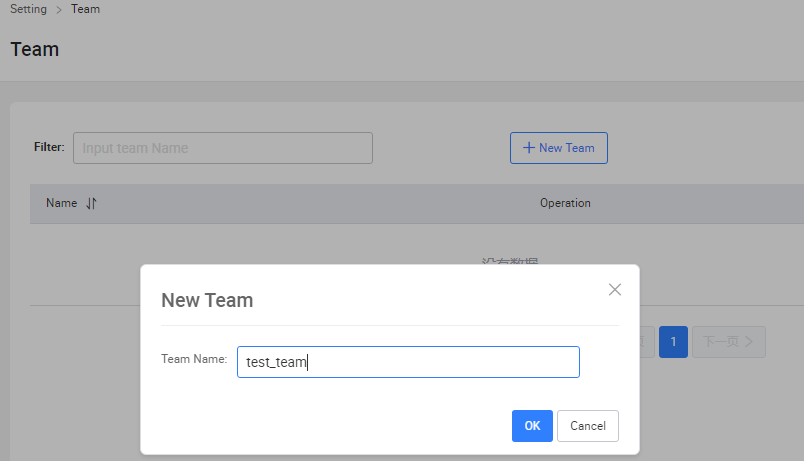

##### 5. 添加team成功之后，点击team Operation中的addUser按钮，选择刚才添加好的user，点击Add User To Team将用户添加到team中
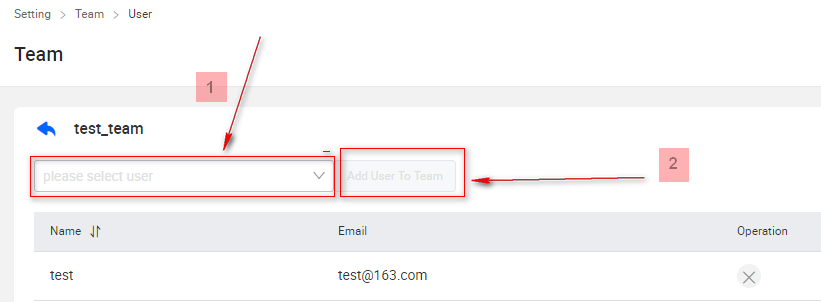

##### 6. 点击右上角图像选择logout退出系统
## 使用创建的test用户登录系统
##### 1. 使用上述创建的用户(test)登录系统
##### 2. 创建topic
   - 进入Topic -> My Task，点击Create Topic Task，根据提示填写topic信息,创建topic(topic_test)，系统会发送提醒邮件至管理员处
   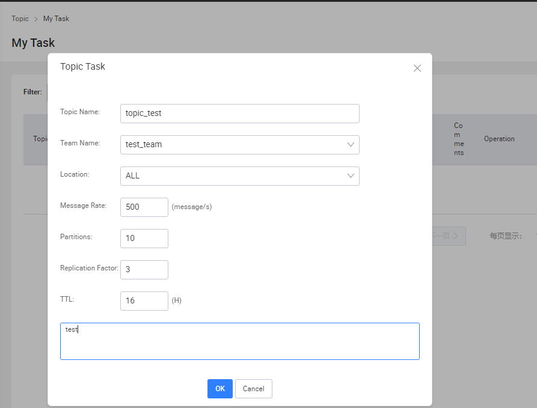   
   - 退出系统，使用testAdmin账户登录系统
   - 进入Approve，选择提交的Topic（topic_test），点击check，选择需要创建的集群，点击Approve。   
   - topic创建成功之后，系统会发送创建成功邮件至用户test
   
   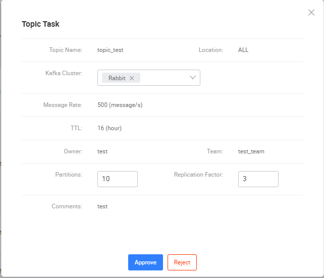
##### 3. 生产消息
   - topic创建成功之后，进入Topic -> Topic List,选择创建的topic（topic_test）选择mock操作
   - 填写message的key和value，点击Send,右边提示PRODUCER TOPIC SUCCESS，生产成功
   
   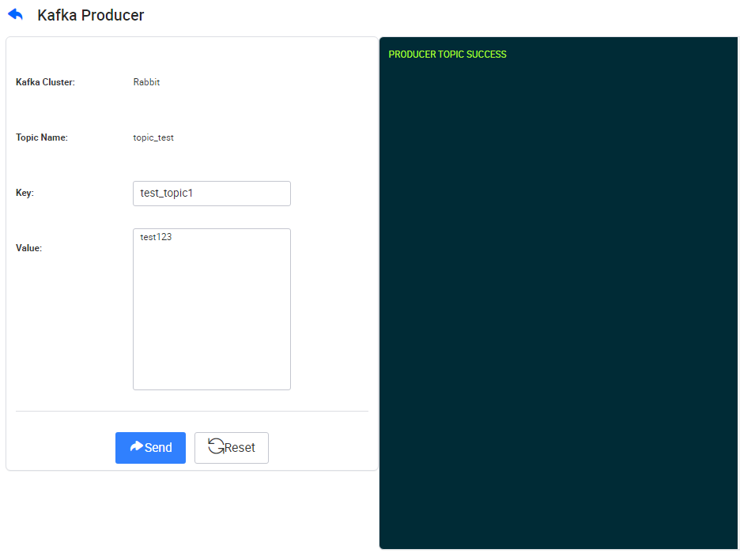
  
##### 4. 监控生产状况
   - topic(topic_test)消息生产成功之后，进入Monitor -> Producer
   - 点击topic(topic_test),进入生产监控信息，显示生产的速率
   
  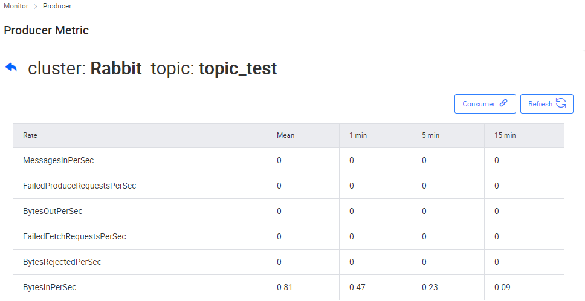
##### 5. 消费消息
   **Important**:如果不选择Commit The Record Consumed的话，在consumer中查看不到消费信息
   - 进入Topic -> Queries
   - 选择cluster和topic name，选择Commit The Record Consumed，点击Query     
   - 消费成功后，右边显示消费到的消息
   
  
    
   
   - 选择Consumer Topic By Offset，选择partition，填写offset，点击Query（指定partition进行消费）
   - 消费成功后，右边显示消费到的消息
   
  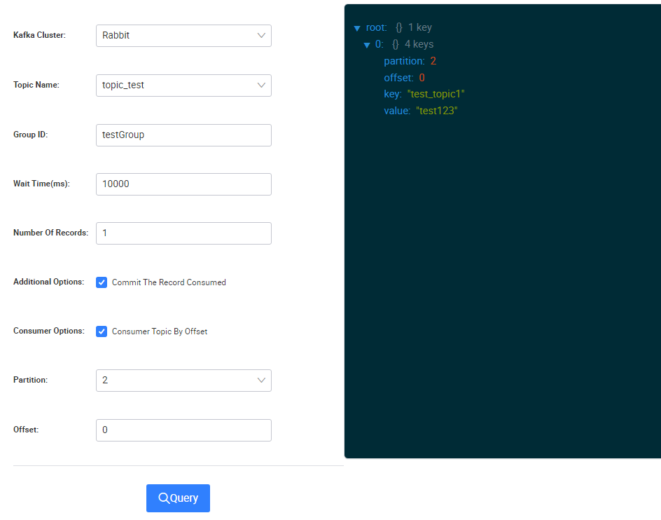
  
##### 6. 监控消费
   -  进入Topic -> Consumer,选择Topic，选择topic(topic_test)，查看消费组消费状态
   
  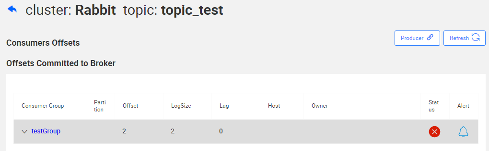

   -  点击消费组后面的alert，为group组添加alert监控，当lag达到配置的值时，系统将发邮件
   
  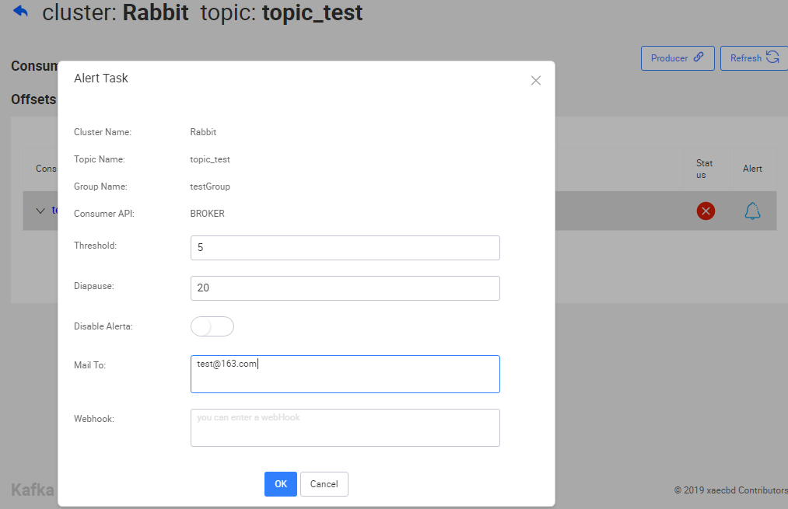
   -  点击上面消费使用的消费组，查看消费lag图  
  
  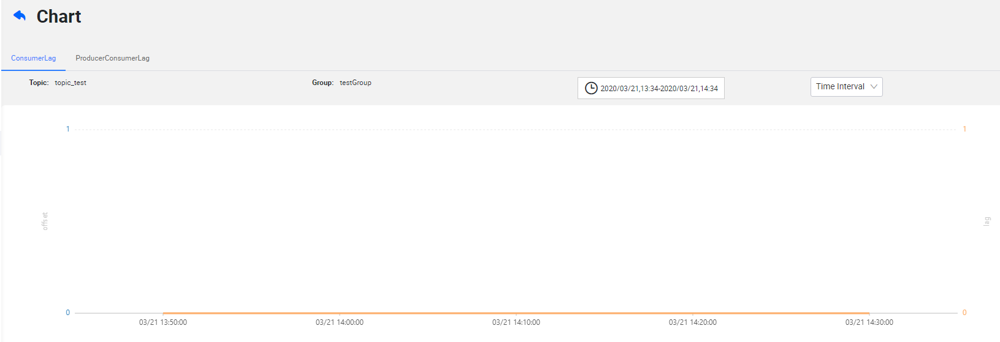
